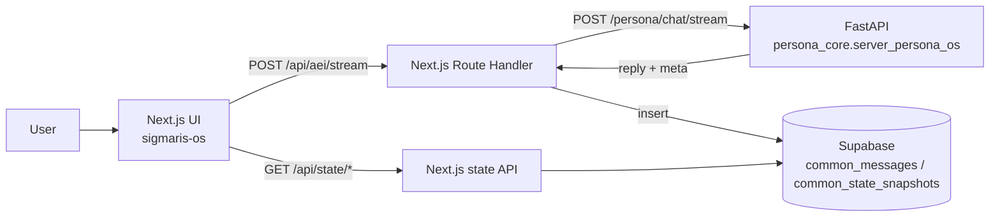

**Languages:** [English](README.md) | 日本語

# Project Sigmaris - Persona OS / LLM Control Plane

Sigmaris は、長期稼働するAI（常駐型のパーソナルAIや業務エージェント）を前提にした **LLM外部制御レイヤ（Control Plane）** のプロトタイプです。

LLMの「応答の賢さ」そのものではなく、次のような **運用上の必須要件** をモデルの外側で扱います。

- セッションをまたぐ同一性（Identity continuity）
- 記憶の取捨選択と再注入（Memory orchestration）
- 価値/特性のドリフト監視（Value/Trait drift）
- 状態機械による挙動統制（Global state machine）
- Safety gating（簡易）
- 追跡可能性（trace_id と meta の記録・可視化）
- Phase02: 時間構造（inertia / stability budget）+ Subjectivity FSM + Failure Detection
- Phase03: 意図ルーティング（カテゴリ + ベクトル）+ 会話状態機械（DSM）+ Safety Override + Observability

このリポジトリに含まれるもの:

- **Backend (Python/FastAPI)**: `POST /persona/chat`（JSON）と `POST /persona/chat/stream`（SSEストリーミング）
- **Frontend (Next.js + Supabase Auth)**: Googleログイン -> チャット -> **状態ダッシュボード**（`/status`）
- **キャラクターチャットUI (Next.js + Supabase Auth)**: `touhou-talk-ui/`（同じエンジン、別UX）
- **Supabase 永続化**: チャットログと状態スナップショットを時系列で保存し、グラフ化する
- **メモリ管理UI**: 永続メモリ（episode）の一覧・削除（`/memory`）

---

## 運用倫理（重要）

Sigmaris は **機能的な連続性** と **運用上の可観測性** を目的にしたシステムです。  
「本物の意識」「実在する感情」「苦痛」などを断定しません。

- 罪悪感・圧力・依存を利用した誘導（感情操作）をしない
- 連続性が低下している場合は、不確実性を明示して“穴埋めの捏造”をしない
- Telemetry（C/N/M/S/R）を用いて、必要に応じて説明寄りの口調に寄せる
- Telemetry の意味は Phase02 定義です（C=Coherence, N=Narrativity, M=Memory, S=Self-modeling, R=Responsiveness）

---

## Sigmaris は「普通のAI」と何が違うのか

多くのチャットAIは「入力→応答」を中心に設計され、会話の一貫性・安全性・状態管理はモデル内部の挙動に依存しがちです。  
Sigmaris はそこを逆転させ、LLMを“頭脳”として使いつつ、**その外側にある制御層（Control Plane）**を実装している点が特徴です。

具体的には、1ターンごとに「何が起きたか」を **meta（可観測データ）**として返し、保存し、検証可能にします（Chain-of-thought は出しません）。

- **Intent（意図）推定**: 単一ラベルではなく混合（ベクトル）で扱う
- **Dialogue State（会話状態）**: DSM/FSMで状態遷移を管理し、急なモード暴走や揺れを抑える
- **Safety Override**: 危険度が一定以上なら、応答方針を強制的に安全側へ上書きする（決定は決定論的）
- **Observability**: ルーティング理由・状態・スコア・処理時間を構造化して返す（監査・改善が可能）

### v0 meta（必ず non-null）

統合・デバッグのため、API の `meta` には常に「最小限の要約（v0）」が入り、`common_state_snapshots.meta` にも保存されます。

- `meta.intent` - 現在の意図ベクトル（best-effort）
- `meta.dialogue_state` - 現在の会話状態
- `meta.telemetry` - `{ C, N, M, S, R }` のスコア
- `meta.safety.total_risk` と `meta.safety.override`
- `meta.decision_candidates` - 判断候補リスト（best-effort / v1）
- `meta.meta_version`, `meta.engine_version`, `meta.build_sha`, `meta.config_hash` - バージョン管理と再現性のためのキー

要するに Sigmaris は、**モデルの賢さを競うプロジェクトではなく、長期稼働AIを“運用できる形”にするための基盤**です。

## どんな分野で役立つか（将来像）

Sigmaris が効くのは「長く動く」「安全・監査・再現性が必要」「状態が重要」な領域です。

- **常駐型パーソナルAI / パートナーAI**: 関係性やモードを安定運用
- **業務エージェント**: ルーティング・安全・監査ログが必要な社内AI運用（サポート/ナレッジ/作業補助）
- **キャラクターチャット**: 役割/創作/雑談/相談の混在でも破綻しにくい“対話制御”
- **ロボット/IoT**: 実世界へ作用する際に、状態機械・安全ゲートが必須になる
- **研究・評価**: 「会話の質」を主観だけでなく、数値ログで追える（改善・比較がしやすい）

## デモで一番刺さるポイント

「返答が賢い」よりも、次が一番伝わります。

> 1ターンごとに内部状態（meta）を数値として返し、保存し、時系列で可視化できる  
> -> 状態を外部から制御できる（安全・安定・ドリフト）

これが "OS" 的に見せられる部分です。

さらに Sigmaris は Trait に「成長（最適化）」の概念を入れています。

- `trait.state` は短期状態（0..1）
- `trait.baseline` はユーザー固有の長期ベースライン（0..1、ニュートラル=0.5）
- `reward_signal`（例: +1 / -1）を渡すと、backend が `trait.baseline` をゆっくり更新し、ダッシュボードでは点線として表示されます

Phase02 では、これに加えて「時間軸の安定性」を扱います。

- Temporal identity: inertia / stability budget / phase transitions
- Subjectivity FSM: S0..S3（EMA + ヒステリシス）
- Failure Detection: Identity Health / Collapse Risk

---

## Architecture (high level)



---

## Repository layout

- `sigmaris_core/` - Persona OS backend（memory / identity / drift / state machine / trace）
- `sigmaris-os/` - Next.js frontend（Supabase Auth, chat UI, `/status` dashboard）
- `touhou-talk-ui/` - キャラクターチャットUI（東方キャラ、音声/TTS 実験など）
- `supabase/RESET_TO_COMMON.sql` - **正とするSupabaseスキーマ**（`common_*` に破壊的リセット）

旧スキーマ（参考として残しています）:

- `sigmaris-os/supabase/FRONTEND_SCHEMA.sql`
- `sigmaris_core/persona_core/storage/SUPABASE_SCHEMA.sql`
- `touhou-talk-ui/supabase/TOUHOU_SCHEMA.sql`

---

## Quickstart (local)

### 1) Backend (FastAPI)

1. `.env.example` -> `.env` にコピーして `OPENAI_API_KEY` を設定
2. 起動:

```bash
python -m uvicorn persona_core.server_persona_os:app --reload --port 8000
```

- Swagger: `http://127.0.0.1:8000/docs`
- Minimal request:

```bash
curl -X POST "http://127.0.0.1:8000/persona/chat" \
  -H "Content-Type: application/json" \
  -d '{"user_id":"u_test_001","session_id":"s_test_001","message":"Hello. Describe your role in one sentence."}'
```

- Streaming（SSE）:

```bash
curl -N -X POST "http://127.0.0.1:8000/persona/chat/stream" \
  -H "Content-Type: application/json" \
  -d '{"user_id":"u_test_001","session_id":"s_test_001","message":"Hello. Stream your reply."}'
```

### 2) Frontend (Next.js)

1. `sigmaris-os/.env.example` -> `sigmaris-os/.env.local` にコピーしてSupabaseの値を設定
2. 起動:

```bash
cd sigmaris-os
npm install
npm run dev
```

- App: `http://localhost:3000`
- Dashboard: `http://localhost:3000/status`

---

## Supabase setup

Supabase の SQL Editor で実行:

- `supabase/RESET_TO_COMMON.sql`（**破壊的リセット**。統一 `common_*` テーブルを作成）

## Operator overrides（任意）

Sigmaris は運用者による上書き（監査ログ付き）を `POST /persona/operator/override` で受け付けます。

`sigmaris-os` では `/status` に Operator パネルを出して、Subjectivity Mode の強制（AUTO/S0..S3）や drift の freeze を設定できます。

必要な環境変数（サーバ側のみ）:

- `SIGMARIS_OPERATOR_KEY`（ヘッダ `x-sigmaris-operator-key` として送信）
- `SIGMARIS_OPERATOR_USER_IDS`（操作を許可する Supabase Auth の user UUID をカンマ区切りで列挙）

`/status` が `PGRST205`（schema cache）で落ちる場合、テーブル作成後に PostgREST のスキーマ再読み込みが必要なことがあります。

---

## Security notes

- `.env` / `.env.local` は絶対にコミットしない（`.gitignore` 済み）
- `SUPABASE_SERVICE_ROLE_KEY` は強権限なので server-side のみで扱う
- 誤ってpushした可能性があるなら、OpenAI/Supabaseのキーはローテーションする

---

## Key endpoints

- Backend: `POST /persona/chat` -> `{ reply, meta }`
- Backend（stream）: `POST /persona/chat/stream` -> SSE（`delta` / `done`）
- Frontend proxy（stream）: `POST /api/aei/stream` -> SSE中継 + `common_messages` / `common_state_snapshots` に保存
- Dashboard APIs: `GET /api/state/latest`, `GET /api/state/timeseries?limit=60`

---

## Benchmark（回帰検知）

Sigmaris には、CI 上で動く **決定論的ベンチ** を同梱しています（OpenAI / Supabase のキー不要）。

- テストケース: `tools/bench/cases_v1.json`
- ベースライン（golden）: `tools/bench/baseline.json`
- 実行:

```bash
python tools/bench/run_bench.py
```

Control Plane の挙動を意図的に変更した場合は、ベースラインを更新します:

```bash
python tools/bench/run_bench.py --write-baseline
```
