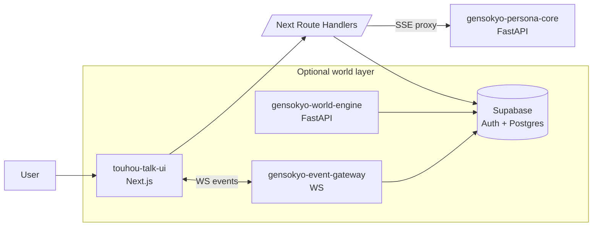

**Languages:** [English](README.md) | 日本語

# Project Sigmaris

Sigmaris は、長期稼働するAI（常駐型パーソナルAIや業務エージェント等）を前提にした **LLM外部制御レイヤ（Control Plane）** のプロトタイプだよ。
モデルを「賢さの箱」として扱い、運用で絶対に必要な要件を **モデルの外側** に明示的に実装する、ってのがミソ。

- セッションをまたぐ連続性（同一性 + 記憶の選別/再注入）
- 決定論的な制御面（ルーティング、状態機械、セーフティ上書き）
- 可観測性（`trace_id` + 構造化 `meta` を保存して検証できる）
- UI + 永続化 +（任意で）ワールドシミュレーションまで含めた“動く統合”

## リポジトリ内のモジュール

| フォルダ | 役割 | README |
|---|---|---|
| `gensokyo-persona-core/` | Persona OS コア（FastAPI。チャット/ストリーミング/外部I/O） | `gensokyo-persona-core/README.ja.md` |
| `touhou-talk-ui/` | UI（Next.js。Supabase Auth、チャットUX、任意でElectronデスクトップ） | `touhou-talk-ui/README.ja.md` |
| `gensokyo-world-engine/` | ワールドエンジン（Command/Eventログ、Time Skipシム。任意） | `gensokyo-world-engine/README.md` |
| `gensokyo-event-gateway/` | WSゲートウェイ（Supabaseのworld eventを順序付き配信。任意） | `gensokyo-event-gateway/README.md` |
| `supabase/` | 正とするSQLスキーマ（`common_*`、world系） | `supabase/RESET_TO_COMMON.sql` |
| `tools/` | 小物ツール（env監査/整理など） | `tools/` |

## 全体アーキテクチャ（ざっくり）


```mermaid
flowchart LR
  U[User] --> UI[touhou-talk-ui<br/>Next.js]
  UI --> API[/Next Route Handlers/]
  API -->|SSE proxy| CORE[gensokyo-persona-core<br/>FastAPI]
  API --> SB[(Supabase<br/>Auth + Postgres)]

  subgraph Optional world layer
    WE[gensokyo-world-engine<br/>FastAPI] --> SB
    GW[gensokyo-event-gateway<br/>WS] --> SB
    UI <-->|WS events| GW
  end
```

## Quickstart（ローカル）

### 前提

- Node.js（LTS）+ npm
- Python 3.11+
- Supabaseプロジェクト（URL + anon key。service role key は **サーバ専用**）

### 1) env を準備（秘密はコミットしない）

このリポジトリは `.env` をデフォルトで ignore してる。まずは例をコピーして埋めよう。

```powershell
Copy-Item .env.example .env
```

最小限（コア + UI起動）:

- `OPENAI_API_KEY`
- `NEXT_PUBLIC_SUPABASE_URL`
- `NEXT_PUBLIC_SUPABASE_ANON_KEY`
- `SUPABASE_SERVICE_ROLE_KEY`（サーバ側のみ）

### 2) Persona OS コア起動

```powershell
cd gensokyo-persona-core
python -m venv .venv
./.venv/Scripts/pip install -r requirements.txt
./.venv/Scripts/python -m uvicorn server:app --reload --host 127.0.0.1 --port 8000
```

Swagger: `http://127.0.0.1:8000/docs`

### 3) UI起動

```powershell
cd touhou-talk-ui
npm install
npm run dev
```

UI: `http://localhost:3000`

## 環境変数の整理（壊れやすい所のチューニング）

- ローカルは `.env.example` を正として運用する
- `touhou-talk-ui` の `npm run dev` は repo root の `.env` を先に読む（`touhou-talk-ui/tools/dev.mjs`）
- 監査/掃除はツールでやる（手作業で事故りがちだから）:

```powershell
node tools/env/env-audit.mjs
node tools/env/prune-dotenv.mjs --in .env --out .env.pruned
```

## 運用倫理（範囲）

Sigmaris は **機能的な連続性** と **運用上の可観測性** を目的にしたシステムで、
「本物の意識」「実在する感情」「苦痛」などを断定しない。

- 罪悪感・圧力・依存を利用した誘導（感情操作）は避ける
- 連続性が落ちたら、穴埋め捏造じゃなく“不確実性の開示”を優先する

## 二次創作（Touhou Talk UI）

`touhou-talk-ui/` は Touhou Project にインスパイアされた **非公式の二次創作UI**。
原作者/権利者とは無関係で、公式に承認されているわけではないよ。
