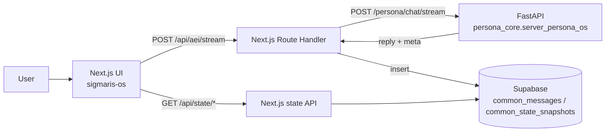

**Languages:** English | [日本語](README.ja.md)

# Project Sigmaris - Persona OS / LLM Control Plane

Sigmaris is a working prototype of a **control plane for long-running LLM personas**.
Instead of relying on “whatever the model does inside a chat session”, Sigmaris keeps key parts **outside the model** as a system:

- Identity continuity across sessions
- Memory selection + reinjection (memory orchestration)
- Value / trait drift tracking
- Global state machine (NORMAL / OVERLOADED / SAFETY_LOCK / etc.)
- Safety gating (simple)
- Traceability (trace_id + auditable `meta`)
- Phase02: Temporal identity + subjectivity modes + failure detection (health / stability budget)
- Phase03: Hybrid intent routing (category + vector) + dialogue state machine + safety override + observability

## Projects (what each folder is)

Sigmaris is split into a backend “engine” and multiple UIs that consume it.

| Project | What it is | Link |
|---|---|---|
| `sigmaris_core` | **The core engine** (Persona OS API). Memory/identity/drift/state/safety/observability live here. | `sigmaris_core/README.md` |
| `sigmaris-os` | **Reference UI** that exposes the core faithfully (chat + dashboards). | `sigmaris-os/README.md` |
| `touhou-talk-ui` | **Variant UI** to stress-test the engine’s generality (character chat UX, assistant-ui, optional desktop wrapper). | `touhou-talk-ui/README.md` |
| `supabase` | Unified schema for persistence (`common_*`). | `supabase/RESET_TO_COMMON.sql` |

This repository includes:

- **Backend (Python / FastAPI)**: `POST /persona/chat` (JSON) and `POST /persona/chat/stream` (SSE streaming)
- **Frontend (Next.js + Supabase Auth)**: Google login -> chat -> **state dashboard** (`/status`)
- **Character chat UI (Next.js + Supabase Auth)**: `touhou-talk-ui/` (same backend engine, different UX)
- **Supabase persistence**: stores chat messages + state snapshots for timeseries graphs
- **Memory management UI**: view & delete episodic memory (`/memory`)

---

## Operational ethics (important)

Sigmaris targets **functional continuity** and **operational observability**. It does **not** claim true consciousness, real feelings, or suffering.

- No deceptive emotional manipulation (no guilt/pressure/dependency loops)
- When continuity is degraded, disclose uncertainty instead of fabricating history
- Relationship-safety hooks use telemetry (C/N/M/S/R) and can shift tone toward informational framing
- Telemetry scores follow Phase02 meanings: C=Coherence, N=Narrativity, M=Memory, S=Self-modeling, R=Responsiveness

---

## How Sigmaris differs from a “normal AI chat”

Most chat systems are built around a simple loop: *input → model → output*.
In that setup, consistency, safety, state transitions, and long-term behavior often become implicit side-effects of the model.

Sigmaris takes a different approach: it treats the LLM as the “brain”, while implementing an explicit **external control plane** around it — designed for long-running, inspectable operation.

Per turn, Sigmaris returns and (optionally) persists structured **observability metadata** describing what happened and why (without exposing chain-of-thought):

- **Intent modeling (hybrid)**: multi-intent vectors instead of a single label
- **Dialogue State Machine (DSM)**: explicit state transitions with hysteresis to avoid oscillation
- **Safety Override**: deterministic safety-first overrides that can constrain or redirect behavior
- **Observability-first**: machine-readable routing reasons, state, scores, and timings

### meta logging (always non-null)

For integration and debugging, the API always includes a compact, non-null summary in `meta` (and it is stored in `common_state_snapshots.meta`):

- `meta.trace_id` - per-turn UUID
- `meta.intent` - current intent distribution (best-effort)
- `meta.dialogue_state` - current dialogue state
- `meta.telemetry` - `{ C, N, M, S, R }` scores
- `meta.safety.total_risk` and `meta.safety.override`
- `meta.decision_candidates` - best-effort decision candidate list (v1)
- `meta.meta_v1` - stable compact summary of the above keys
- `meta.meta_version`, `meta.engine_version`, `meta.build_sha`, `meta.config_hash` - versioning + reproducibility keys

In short, Sigmaris is not a “smarter chatbot” — it’s infrastructure for operating LLMs **safely, consistently, and audibly over time**.

## Where it can be useful (future-facing)

Sigmaris is most valuable in domains where an AI must run continuously and remain controllable.

- **Always-on personal AI / partner AI**: stable behavior across sessions and modes
- **Enterprise agents**: safety gates, audit trails, reproducibility, and policy-driven routing
- **Character chat**: robust mixing of roleplay, casual talk, coaching, and meta conversation
- **Robotics / IoT**: state machines and safety overrides become essential once actions affect the real world
- **Research & evaluation**: conversation quality can be analyzed via time-series telemetry, not only subjective impressions

## What to demo (the “OS” part)

The strongest demo is not “the reply is smart”, but:

> You can return internal state (`meta`) as numbers per turn, store it, and visualize it over time  
> -> use state as an external control surface (safety, stability, drift).

Sigmaris also supports a simple **growth** concept for traits:

- `trait.state` is the short-term state (0..1)
- `trait.baseline` is a user-specific long-term baseline (0..1, neutral=0.5)
- when `reward_signal` is provided (e.g. +1 / -1), the backend updates `trait.baseline` slowly and the dashboard shows it as dashed lines

And Phase02 adds **time-structured stability** on top:

- Temporal identity: inertia + stability budget + phase transitions
- Subjectivity FSM: S0..S3 with EMA + hysteresis
- Failure detection: identity health score + collapse risk signals

---

## Architecture (high level)



---

## Repository layout

- `sigmaris_core/` - Persona OS backend (memory / identity / drift / state machine / trace)
- `sigmaris-os/` - Next.js frontend (Supabase Auth, chat UI, `/status` dashboard)
- `touhou-talk-ui/` - character chat UI (Touhou personas, voice/TTS experiments, etc.)
- `supabase/RESET_TO_COMMON.sql` - **authoritative Supabase schema** (destructive reset to `common_*` tables)

Deprecated schemas (kept for reference):

- `sigmaris-os/supabase/FRONTEND_SCHEMA.sql`
- `sigmaris_core/persona_core/storage/SUPABASE_SCHEMA.sql`
- `touhou-talk-ui/supabase/TOUHOU_SCHEMA.sql`

---

## Quickstart (local)

### 1) Backend (FastAPI)

1. Copy `.env.example` -> `.env` and set `OPENAI_API_KEY`
2. Run:

```bash
python -m uvicorn persona_core.server_persona_os:app --reload --port 8000
```

- Swagger UI: `http://127.0.0.1:8000/docs`
- Minimal request:

```bash
curl -X POST "http://127.0.0.1:8000/persona/chat" \
  -H "Content-Type: application/json" \
  -d '{"user_id":"u_test_001","session_id":"s_test_001","message":"Hello. Describe your role in one sentence."}'
```

- Streaming (SSE):

```bash
curl -N -X POST "http://127.0.0.1:8000/persona/chat/stream" \
  -H "Content-Type: application/json" \
  -d '{"user_id":"u_test_001","session_id":"s_test_001","message":"Hello. Stream your reply."}'
```

### 2) Frontend (Next.js)

1. Copy `sigmaris-os/.env.example` -> `sigmaris-os/.env.local` and set your Supabase values
2. Run:

```bash
cd sigmaris-os
npm install
npm run dev
```

- App: `http://localhost:3000`
- Dashboard: `http://localhost:3000/status`

---

## Supabase setup

Run this in the Supabase SQL Editor:

- `supabase/RESET_TO_COMMON.sql` (**destructive reset**, recreates unified `common_*` tables)

---

## Admin log export (touhou-talk-ui)

In `touhou-talk-ui`, you can type `/dump` in chat to export the current session logs as a JSON download.

This is **admin-restricted**. Set one of the following (comma-separated Supabase Auth user UUIDs):

- `TOUHOU_ADMIN_USER_IDS`
- `SIGMARIS_OPERATOR_USER_IDS`

---

## Deploy (Fly.io) — Backend only

The backend can be deployed to Fly.io using the included `Dockerfile` + `fly.toml`.

1) Install and login:

```bash
flyctl auth login
```

2) Create an app (or edit `fly.toml` `app = "..."` first):

```bash
flyctl apps create
```

3) Set secrets (minimum):

```bash
flyctl secrets set OPENAI_API_KEY="..." SUPABASE_URL="..." SUPABASE_SERVICE_ROLE_KEY="..."
```

Optional:

- `SUPABASE_SCHEMA` (default `public`)
- `SIGMARIS_ENGINE_VERSION`
- `SIGMARIS_BUILD_SHA`
- `SIGMARIS_OPERATOR_KEY`, `SIGMARIS_OPERATOR_USER_IDS` (operator overrides)

4) Deploy:

```bash
flyctl deploy
```

After deploy:

- Swagger: `https://<your-app>.fly.dev/docs`
- Health check uses `GET /docs` (see `fly.toml`).

## Operator overrides (optional)

Sigmaris supports audited operator overrides via `POST /persona/operator/override`.

In `sigmaris-os`, the `/status` page can show an Operator panel to set a forced Subjectivity mode and/or freeze drift updates.

Environment variables (server-side only):

- `SIGMARIS_OPERATOR_KEY` - shared secret sent as `x-sigmaris-operator-key`
- `SIGMARIS_OPERATOR_USER_IDS` - comma-separated Supabase Auth user UUIDs allowed to operate (e.g. `uuid1,uuid2`)

If `/status` fails with `PGRST205` (schema cache), you may need to refresh PostgREST schema after creating tables.

---

## Security notes

- Never commit `.env` / `.env.local` (this repo ignores them via `.gitignore`)
- `SUPABASE_SERVICE_ROLE_KEY` is highly privileged; keep it server-side only
- If you ever pushed secrets by mistake, rotate keys immediately

---

## Key endpoints

- Backend: `POST /persona/chat` -> `{ reply, meta }`
- Backend (stream): `POST /persona/chat/stream` -> SSE (`delta` / `done` events)
- Frontend proxy (stream): `POST /api/aei/stream` -> proxies SSE + stores `common_messages` / `common_state_snapshots`
- Dashboard APIs: `GET /api/state/latest`, `GET /api/state/timeseries?limit=60`

---

## Benchmark (regression)

Sigmaris includes a small **deterministic benchmark** that runs in CI (no OpenAI/Supabase keys required).

- Test cases: `tools/bench/cases_v1.json`
- Baseline (golden): `tools/bench/baseline.json`
- Runner:

```bash
python tools/bench/run_bench.py
```

If you intentionally change the control-plane behavior, update the baseline:

```bash
python tools/bench/run_bench.py --write-baseline
```
