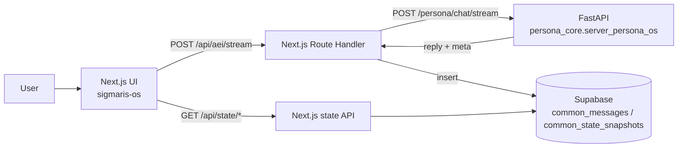

**Languages:** English | [日本語](README.ja.md)

# Project Sigmaris - Persona OS / LLM Control Plane

Sigmaris is a working prototype of a **control plane for long-running LLM personas**.
Instead of relying on “whatever the model does inside a chat session”, Sigmaris keeps key parts **outside the model** as a system:

- Identity continuity across sessions
- Memory selection + reinjection (memory orchestration)
- Value / trait drift tracking
- Global state machine (NORMAL / OVERLOADED / SAFETY_LOCK / etc.)
- Safety gating (simple)
- Traceability (trace_id + auditable `meta`)
- Phase02: Temporal identity + subjectivity modes + failure detection (health / stability budget)

This repository includes:

- **Backend (Python / FastAPI)**: `POST /persona/chat` (JSON) and `POST /persona/chat/stream` (SSE streaming)
- **Frontend (Next.js + Supabase Auth)**: Google login -> chat -> **state dashboard** (`/status`)
- **Character chat UI (Next.js + Supabase Auth)**: `touhou-talk-ui/` (same backend engine, different UX)
- **Supabase persistence**: stores chat messages + state snapshots for timeseries graphs
- **Memory management UI**: view & delete episodic memory (`/memory`)

---

## Operational ethics (important)

Sigmaris targets **functional continuity** and **operational observability**. It does **not** claim true consciousness, real feelings, or suffering.

- No deceptive emotional manipulation (no guilt/pressure/dependency loops)
- When continuity is degraded, disclose uncertainty instead of fabricating history
- Relationship-safety hooks use telemetry (C/N/M/S/R) and can shift tone toward informational framing
- Telemetry scores follow Phase02 meanings: C=Coherence, N=Narrativity, M=Memory, S=Self-modeling, R=Responsiveness

## What to demo (the “OS” part)

The strongest demo is not “the reply is smart”, but:

> You can return internal state (`meta`) as numbers per turn, store it, and visualize it over time  
> -> use state as an external control surface (safety, stability, drift).

Sigmaris also supports a simple **growth** concept for traits:

- `trait.state` is the short-term state (0..1)
- `trait.baseline` is a user-specific long-term baseline (0..1, neutral=0.5)
- when `reward_signal` is provided (e.g. +1 / -1), the backend updates `trait.baseline` slowly and the dashboard shows it as dashed lines

And Phase02 adds **time-structured stability** on top:

- Temporal identity: inertia + stability budget + phase transitions
- Subjectivity FSM: S0..S3 with EMA + hysteresis
- Failure detection: identity health score + collapse risk signals

---

## Architecture (high level)



---

## Repository layout

- `sigmaris_core/` - Persona OS backend (memory / identity / drift / state machine / trace)
- `sigmaris-os/` - Next.js frontend (Supabase Auth, chat UI, `/status` dashboard)
- `touhou-talk-ui/` - character chat UI (Touhou personas, voice/TTS experiments, etc.)
- `supabase/RESET_TO_COMMON.sql` - **authoritative Supabase schema** (destructive reset to `common_*` tables)

Deprecated schemas (kept for reference):

- `sigmaris-os/supabase/FRONTEND_SCHEMA.sql`
- `sigmaris_core/persona_core/storage/SUPABASE_SCHEMA.sql`
- `touhou-talk-ui/supabase/TOUHOU_SCHEMA.sql`

---

## Quickstart (local)

### 1) Backend (FastAPI)

1. Copy `.env.example` -> `.env` and set `OPENAI_API_KEY`
2. Run:

```bash
python -m uvicorn persona_core.server_persona_os:app --reload --port 8000
```

- Swagger UI: `http://127.0.0.1:8000/docs`
- Minimal request:

```bash
curl -X POST "http://127.0.0.1:8000/persona/chat" \
  -H "Content-Type: application/json" \
  -d '{"user_id":"u_test_001","session_id":"s_test_001","message":"Hello. Describe your role in one sentence."}'
```

- Streaming (SSE):

```bash
curl -N -X POST "http://127.0.0.1:8000/persona/chat/stream" \
  -H "Content-Type: application/json" \
  -d '{"user_id":"u_test_001","session_id":"s_test_001","message":"Hello. Stream your reply."}'
```

### 2) Frontend (Next.js)

1. Copy `sigmaris-os/.env.example` -> `sigmaris-os/.env.local` and set your Supabase values
2. Run:

```bash
cd sigmaris-os
npm install
npm run dev
```

- App: `http://localhost:3000`
- Dashboard: `http://localhost:3000/status`

---

## Supabase setup

Run this in the Supabase SQL Editor:

- `supabase/RESET_TO_COMMON.sql` (**destructive reset**, recreates unified `common_*` tables)

## Operator overrides (optional)

Sigmaris supports audited operator overrides via `POST /persona/operator/override`.

In `sigmaris-os`, the `/status` page can show an Operator panel to set a forced Subjectivity mode and/or freeze drift updates.

Environment variables (server-side only):

- `SIGMARIS_OPERATOR_KEY` - shared secret sent as `x-sigmaris-operator-key`
- `SIGMARIS_OPERATOR_USER_IDS` - comma-separated Supabase Auth user UUIDs allowed to operate (e.g. `uuid1,uuid2`)

If `/status` fails with `PGRST205` (schema cache), you may need to refresh PostgREST schema after creating tables.

---

## Security notes

- Never commit `.env` / `.env.local` (this repo ignores them via `.gitignore`)
- `SUPABASE_SERVICE_ROLE_KEY` is highly privileged; keep it server-side only
- If you ever pushed secrets by mistake, rotate keys immediately

---

## Key endpoints

- Backend: `POST /persona/chat` -> `{ reply, meta }`
- Backend (stream): `POST /persona/chat/stream` -> SSE (`delta` / `done` events)
- Frontend proxy (stream): `POST /api/aei/stream` -> proxies SSE + stores `common_messages` / `common_state_snapshots`
- Dashboard APIs: `GET /api/state/latest`, `GET /api/state/timeseries?limit=60`
